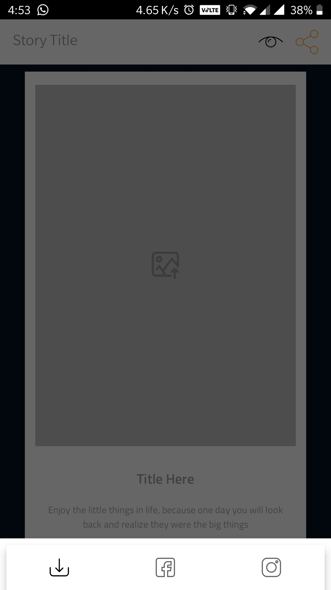

# Open World - A Collage Creator

Screenshots

<table>
  <tr>
    <td><td>
    <td><td>
  </tr>
  <tr>
    <td><td>
    <td><td>
  </tr>
  <tr>
    <td><td>
    <td><td>
  </tr>
</table>

Development

- Android Lifecycle

Dependencies used

- Shapeofview
- Easy Permissions
- Stetho
- Robolectric
- Glide
